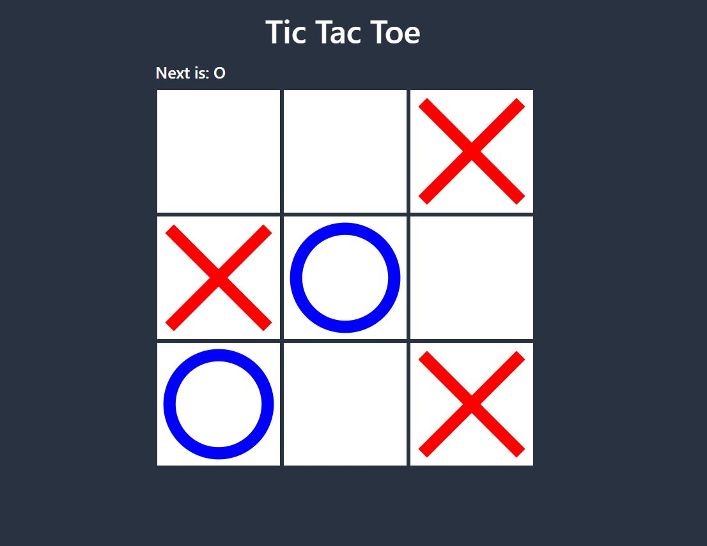

# Tic Tac Toe

The classic game of tic-tac-toe/ X & O

## Gameplay :information_source:

On a square, 3 × 3 field, the two players take turns placing their mark (one player crosses, the other circle) in a free field.

- The first player to put three characters in a row, column or diagonal wins.
- However, if both players play optimally, neither can win and it will be a draw. That is, all nine fields are filled without a player being able to put the required characters in a row, column or diagonal.

## Technologies:pencil:

HTML CSS JavaScript
